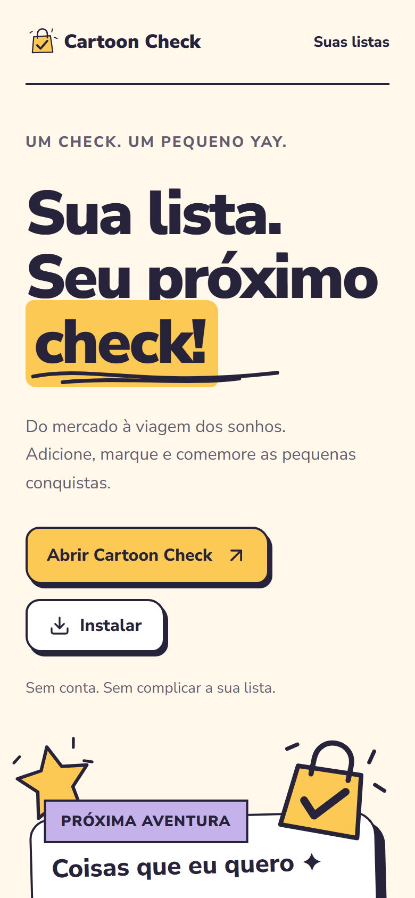
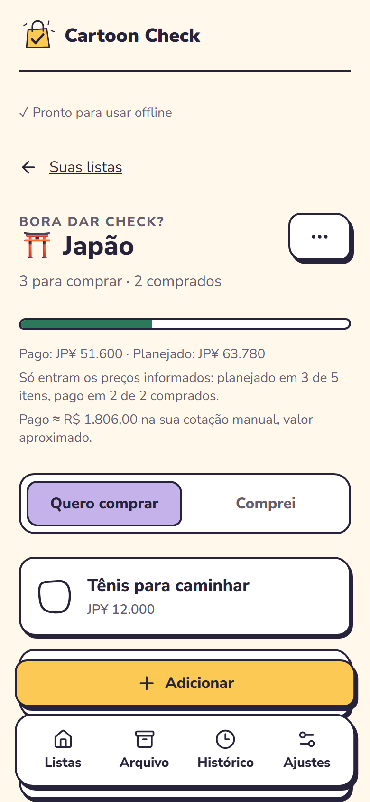
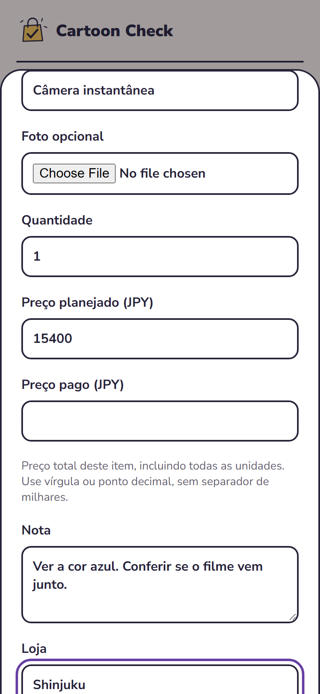
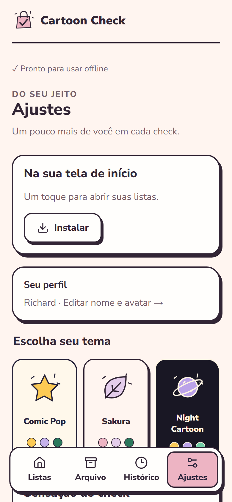
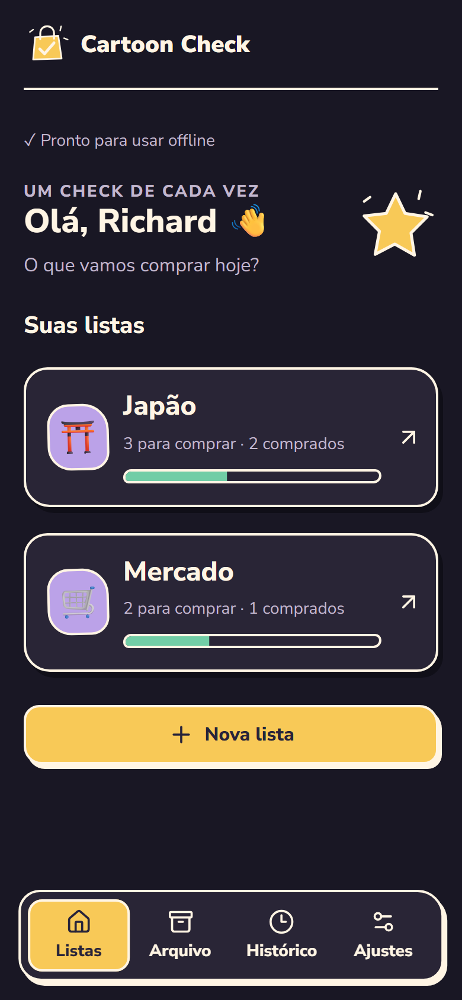

# Cartoon Check

**Add. Check. Celebrate.**

A shopping list app with a cartoon identity of its own. You add an item by
name, check it when you buy it, and the list celebrates with you. Everything
stays on your device and keeps working offline.

The interface is in Brazilian Portuguese.

<p>
  
  
  
  
  
</p>

## What it does

- **Lists**: create, edit, archive, reactivate and delete, each with an emoji
  and a currency.
- **Quick add**: only a name is required, and the field stays ready for the
  next item.
- **Check and celebrate**: a drawn check, a short particle burst, and a larger
  one when the last pending item is bought.
- **Undo**: the last purchase, removal or archiving can be undone, with no
  time limit while the bar is on screen.
- **Optional details**: photo, note, store, link, quantity, planned and paid
  price. Prices are totals per item, stored as integers.
- **Manual exchange rate**: an approximate conversion to a second currency,
  with exact arithmetic. No rates are fetched from the internet.
- **History**: a readable log of what was added, bought, undone and removed.
- **Three themes**: Comic Pop, Sakura and Night Cartoon.
- **Backup and restore**: one file with all data and photos, validated before
  anything is replaced.
- **Installable and offline**: a PWA with guarded updates that never reload
  over unsaved work.

Out of scope for this version: accounts, sync, sharing, budgets, categories,
swipe gestures, sound and notifications.

## Privacy

There is no backend and no account. Profile, lists, history and photos live in
IndexedDB in your browser. The app makes no analytics, advertising or
third-party requests, and the hosting configuration enforces this with a
content security policy that only allows its own origin. The only network
traffic is the download of the app's own files.

Clearing the browser's site data removes your lists. A backup file is the way
to keep a copy; it contains your data unencrypted, so store it somewhere safe.

## Getting started

Use Node.js **24.18.1** and npm **11 or newer**.

```sh
git clone https://github.com/RDEsley/CartoonCheck.git
cd CartoonCheck
npm ci
npm run dev
```

On Windows PowerShell, use `npm.cmd` if the execution policy blocks `npm.ps1`.

| Command                | Purpose                                             |
| ---------------------- | --------------------------------------------------- |
| `npm run dev`          | Start the development server                        |
| `npm run lint`         | Type-aware linting, no warnings allowed             |
| `npm run format`       | Format the code with Prettier                       |
| `npm run typecheck`    | Check application, tooling and test types           |
| `npm run test:run`     | Unit and integration tests                          |
| `npm run test:e2e`     | Browser tests against the development server        |
| `npm run build`        | Typecheck and build to `dist/`                      |
| `npm run budget`       | Check the size budgets of the build                 |
| `npm run test:pwa`     | Browser tests against the production build          |
| `npm run preview`      | Serve the production build locally                  |
| `npm run icons`        | Regenerate the PNG icons from `public/icon.svg`     |

Browser tests need Chromium once: `npx playwright install chromium`.

## Stack

React 19, TypeScript 6 (strict), Vite 8, CSS Modules, React Router, Dexie over
IndexedDB, Zod, Radix Dialog, Motion, Lucide, fflate and vite-plugin-pwa.
Tests use Vitest, Testing Library, fake-indexeddb, Playwright and axe-core.

## How it is built

```text
src/
  app/           Providers, shell, feedback bar and runtime bootstrap
  routes/        Landing page
  components/    Buttons, checkbox, sheets, headings and artwork
  features/      lists, items, history, profile, settings, backup, install
  db/            Schema, models, connection lifecycle and shared guards
  celebrations/  Purchase and completion effects
  animations/    Motion tokens and on-demand animation features
  pwa/           Session locks, updates, drafts and storage persistence
  lib/           Money, links, identifiers and error messages
tests/
  integration/   Commands against fake-indexeddb
  e2e/           Chromium against the development server
  pwa/           Chromium against the production build
```

Screens call domain commands; a command validates its input and writes the
entity and its history entry in one transaction; live queries bring the result
back to the interface. Animations start only after a write is confirmed and
never decide whether something was saved.

More detail is in [docs/architecture.md](docs/architecture.md).

## Quality

**Accessibility.** The target is WCAG 2.2 AA. An automated axe audit covers
every screen and dialog in the three themes. Separate tests cover keyboard
use, focus after each action, reduced motion and seven viewport sizes from
320 px to desktop, including landscape. No screen reader session on a real
device was performed.

**Performance.** Budgets are checked in CI. Measured on the production build:

| Measure                                   | Budget    | Result    |
| ----------------------------------------- | --------- | --------- |
| JavaScript for the first screen (gzip)    | 220 KiB   | 172 KiB   |
| Files stored for offline use              | 2.5 MiB   | 0.9 MiB   |
| Largest contentful paint, first visit     | 2.5 s     | 2.1 s     |
| Cumulative layout shift, first visit      | 0.1       | 0.00      |
| Checking an item in a 1000-item list      | n/a       | ~20 ms    |
| Same, with the processor 4x slower        | 150 ms    | ~175 ms   |
| Export / restore of a 64 MiB backup       | n/a       | ~1 s / ~7 s |

Paint and shift use a throttled phone profile in desktop Chromium (1.6 Mbps,
150 ms latency, processor 4x slower). The item and backup timings come from a
development laptop. The 150 ms target is for a mid-range phone; the throttled
figure is only a stand-in for one and is slightly above the target with 1000
items (about 115 ms with 200).

## Known limitations

- **Not yet tested on physical devices.** Installation, the on-screen
  keyboard, safe areas and haptics were checked only in desktop Chromium with
  mobile emulation. Android Chrome and iOS Safari on real hardware are
  untested.
- Only Chromium is covered by the automated tests.
- On iOS, an installed web app may have storage separate from Safari. Export a
  backup before installing and restore it in the installed app.
- Browsers may evict local data under storage pressure. The app asks for
  persistent storage, which the browser may refuse.
- HEIC photos are not supported; use JPEG, PNG or WebP.
- Flag emoji have no glyph on Windows and show as letters there.

## Deployment

The build is static. `vercel.json` serves `dist/`, rewrites only the app's own
routes to `index.html`, returns a real 404 for anything else, caches hashed
assets as immutable and sets the security headers. Any static host that can
reproduce those rules works.

## License

[MIT](LICENSE). Copyright 2026 Richard Oliveira. The bundled Nunito Sans font
is licensed under the [SIL Open Font License](src/assets/fonts/OFL.txt).
